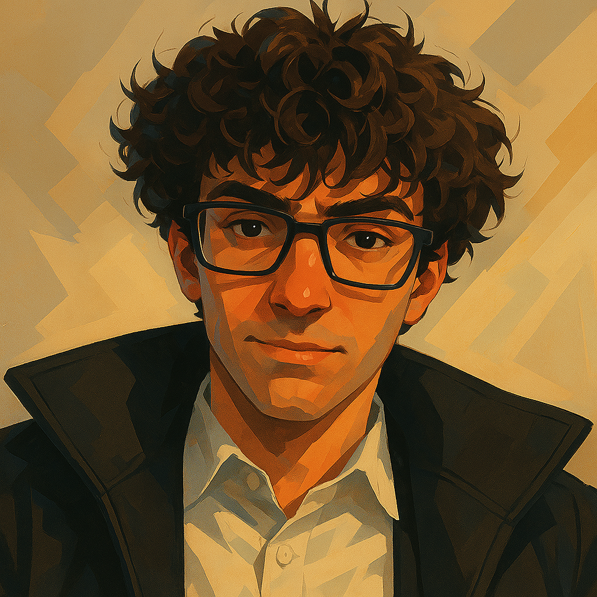

<div align="center">

  
# bayfield.dev
My personal portfolio website built with Next.js.

</div>
  
# 📖 • Summary

- [🚀 • Presentation](#--presentation)
- [📃 • Credits](#--credits)
- [📝 • License](#--license)

# 🚀 • Presentation

This repository contains the source code for my personal portfolio website, showcasing my projects, skills, and experiences. Built with Next.js, it offers a modern and responsive design.

# 💻 • Installation

To run this project locally, follow these steps:
1. Clone the repository:
   ```bash
   git clone https://github.com/PaulBayfield/bayfield.dev.git
   ```
2. Navigate to the project directory:
   ```bash
    cd bayfield.dev
    ```
3. Install the dependencies:
    ```bash
    npm install
    ```
4. Start the development server:
    ```bash
    npm run dev
    ```
5. Open your browser and go to `http://localhost:3000` to view the website.

# 📃 • Credits

- [Paul Bayfield](https://github.com/PaulBayfield)

# 📝 • License

This project is licensed under the Apache License 2.0 - see the [LICENSE](LICENSE) file for details.
