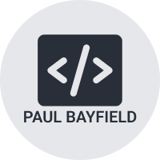

<div align="center">
    
    <h1><a href="https://bayfield.dev">bayfield.dev</a></h1>
</div>


#  Français
- [Introduction](#introduction)
- [Installation](#installation)
- [Utilisation](#utilisation)
- [Licence](#licence)
- [Crédits](#credits)

#  English
- [Introduction](#introduction-1)
- [Installation](#installation-1)
- [Usage](#usage)
- [License](#license)
- [Credits](#credits-1)


---
#  Français

## Introduction

Bienvenue sur le dépôt de mon site internet [bayfield.dev](https://bayfield.dev) !  
Ce site est un site personnel, il me permet de présenter mes projets, mes compétences et mes expériences. De plus, il sert aussi de test pour des projets en développement tel que [saintthibault.bayfield.dev](https://saintthibault.bayfield.dev).  
Le site est développé en Python avec le framework Flask, il utilise une base de données PostgreSQL pour stocker les informations et sessions des utilisateurs.  
  
Le site ne peut être lancé que sous une distribution Linux (tel que `Ubuntu` ou `Raspberry Pi OS`) car certaines dépendances ne sont pas disponibles sous Windows (`fcntl` par exemple).


## Installation

Pour installer le site, il vous suffit de :

- cloner le dépôt,
```sh
git clone https://github.com/PaulBayfield/bayfield.dev.git
```
- installer les dépendances,
```sh	
pip install -r requirements.txt
```
- configurer le serveur,
```sh
cp .env.example .env
nano .env
```
> **Note**
> 
> <div style="background-color:#415971">
> <pre><code>DOMAIN_NAME = bayfield.dev</code><hr><span style="color:#00b300">Nom de domaine du site, <strong>obligatoire pour le bon fonctionnement des sous domaines</strong> !
> </span></pre>
> </div>
> <div style="background-color:#415971">
> <pre><code>DOWNLOAD_PATH = "/downloads"</code><hr><span style="color:#00b300">Nom du fichier pour les téléchargements.
> </span></pre>
> </div>
> <div style="background-color:#415971">
> <pre><code>MAX_DURATION = 7200</code><hr><span style="color:#00b300">Durée maximale d'une vidéo en secondes (2 heures par défaut). 
> </span></pre>
> </div>
> <div style="background-color:#415971">
> <pre><code>MAX_SAVE = 172800</code><hr><span style="color:#00b300">Durée maximale de sauvegarde d'une vidéo en secondes (48 heures par défaut). 
> </span></pre>
> </div>
> <div style="background-color:#415971">
> <pre><code>POSTGRES_DATABASE = 
> POSTGRES_USER = 
> POSTGRES_PASSWORD = 
> POSTGRES_HOST = 
> POSTGRES_PORT = </code><hr><span style="color:#00b300">Configuration de la base de données PostgreSQL.
> </span></pre>
> </div>
- lancer le site,
```sh
python3 bayfield.dev/launch.py
```
> **Note**
> 
> Le site sera lancé sur le port `80` par défaut, si vous souhaitez le lancer sur un autre port, il vous suffit de modifier le fichier `bayfield.dev/launch.py` et de modifier la variable `options`, `"bind": "0.0.0.0:PORT"` en spécifiant votre `PORT`.   
Le site sera exécuté à l'aide du serveur HTTP WSGI `gunicorn`.


## Utilisation

Le site est composé de plusieurs pages :
- [bayfield.dev](https://bayfield.dev) : Page d'accueil du site, elle présente mes projets, compétences et expériences. Elle fait office de Portfolio.
- [youtube.bayfield.dev](https://youtube.bayfield.dev) : Youtube Downloader, permet de télécharger des vidéos Youtube.
- [saintthibault.bayfield.dev](https://saintthibault.bayfield.dev) : Site du centre équestre de Saint-Thibault.


## Licence

Le projet est sous licence [MIT](https://github.com/PaulBayfield/bayfield.dev/blob/main/LICENSE).


## Credits

- [Quart](https://pgjones.gitlab.io/quart/)
- [yt-dlp](https://github.com/yt-dlp/yt-dlp)
- [python-dotenv](https://pypi.org/project/python-dotenv/)
- [gunicorn](https://gunicorn.org/)
- [asyncpg](https://github.com/MagicStack/asyncpg)
- [psycopg](https://www.psycopg.org/)
- [apscheduler](https://apscheduler.readthedocs.io/en/stable/)

Site entièrement réalisé par [Paul Bayfield](https://github.com/PaulBayfield).


---

#  English

## Introduction

Welcome to the repository of my website [bayfield.dev](https://bayfield.dev)!  
This is a personal website, it allows me to present my projects, my skills and my experiences. In addition, it also serves as a test for projects under development such as [saintthibault.bayfield.dev](https://saintthibault.bayfield.dev).  
The website is developed in Python with the Flask framework, it uses a PostgreSQL database to store user information and sessions.
  
The website can only be launched under a Linux distribution (such as `Ubuntu` or `Raspberry Pi OS`) because some dependencies are not available under Windows (`fcntl` for example).


## Installation

To install the website, you just need to:
- clone the repository,
```sh
git clone https://github.com/PaulBayfield/bayfield.dev.git
```
- install the dependencies,
```sh
pip install -r requirements.txt
```
- configure the server,
```sh
cp .env.example .env
nano .env
```
> **Note**
>
> <div style="background-color:#415971">
> <pre><code>DOMAIN_NAME = bayfield.dev</code><hr><span style="color:#00b300">Domain name of the site, <strong>required for the proper functioning of subdomains</strong> !
> </span></pre>
> </div>
> <div style="background-color:#415971">
> <pre><code>DOWNLOAD_PATH = "/downloads"</code><hr><span style="color:#00b300">Name of the file for the downloads.
> </span></pre>
> </div>
> <div style="background-color:#415971">
> <pre><code>MAX_DURATION = 7200</code><hr><span style="color:#00b300">Maximum duration of a video in seconds (2 hours by default).
> </span></pre>
> </div>
> <div style="background-color:#415971">
> <pre><code>MAX_SAVE = 172800</code><hr><span style="color:#00b300">Maximum duration a video should be saved in seconds (48 hours by default).
> </span></pre>
> </div>
> <div style="background-color:#415971">
> <pre><code>POSTGRES_DATABASE =
> POSTGRES_USER =
> POSTGRES_PASSWORD =
> POSTGRES_HOST =
> POSTGRES_PORT = </code><hr><span style="color:#00b300">Configuration of the PostgreSQL database.
> </span></pre>
> </div>
- launch the website,
```sh
python3 bayfield.dev/launch.py
```
> **Note**
>
> The website will be launched on port `80` by default, if you want to launch it on another port, you just have to modify the file `bayfield.dev/launch.py` and modify the variable `options`, `"bind": "0.0.0.0:PORT"` by specifying your `PORT`.
The website will be executed using the WSGI HTTP server `gunicorn`.


## Usage

The website is composed of several pages:
- [bayfield.dev](https://bayfield.dev) : Home page of the website, it presents my projects, skills and experiences. It serves as a Portfolio.
- [youtube.bayfield.dev](https://youtube.bayfield.dev) : Youtube Downloader, allows you to download Youtube videos.
- [saintthibault.bayfield.dev](https://saintthibault.bayfield.dev) : Website of the Saint-Thibault equestrian center.


## License

The project is under the [MIT](https://github.com/PaulBayfield/bayfield.dev/blob/main/LICENSE) license.


## Credits

- [Quart](https://pgjones.gitlab.io/quart/)
- [yt-dlp](https://github.com/yt-dlp/yt-dlp)
- [python-dotenv](https://pypi.org/project/python-dotenv/)
- [gunicorn](https://gunicorn.org/)
- [asyncpg](https://github.com/MagicStack/asyncpg)
- [psycopg](https://www.psycopg.org/)
- [apscheduler](https://apscheduler.readthedocs.io/en/stable/)

Website entirely made by [Paul Bayfield](https://github.com/PaulBayfield).
